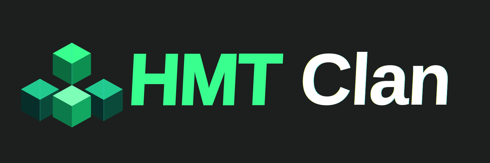

import { LinkCard, Aside } from "@astrojs/starlight/components";

This modpack aims to make Community CraftAttack Servers more enjoyable. It offers significantly more improvements and features than Vanilla Minecraft or the [HM Basic Play](/projects/modpacks/hm-basic-play) modpack. In comparison with [HM Life+](/projects/modpacks/hm-lifep) this Modpack adds more mods that are very useful on those Community CraftAttack servers, but banned from most normal SMPs. But the biggest difference is the GUI. The HMT Pack adds a custom UI with custom buttons in containers like the survival inventory. These buttons trigger several commands on Servers like `/craft` or `/ec`.

While pre-configured for the **TheScape.de** server and the **HMT Clan**, this modpack can easily be used on other servers as well. In future updates, you will also be able to fully customize all UI buttons and feature shortcuts to fit your own preferences!

This modpack will be restricted on some public servers due to mods like MouseTweaks or ClientSort. Use it at your own risk and stay informed about server rules.

## Features

- **Small Performance Optimizations:** Built on the latest Fabric loader with essential performance mods like Sodium, Lithium, and FerriteCore for a fast, smooth, and stutter-free experience.
- **Custom Server GUI & Quick Commands:** Features a heavily customized user interface with dedicated on-screen buttons in inventories to trigger common SMP server commands like `/craft` or `/ec` instantly-tailored for TheScape.de and HMT Clan workflows.
- **Advanced Quality of Life (QoL):** Packed with powerful utilities including Freecam, MouseTweaks, ClientSort, and dynamic crosshairs to streamline inventory management and navigation.
- **Visual Improvements & Aesthetics:** Upgrades your game's graphics with Iris Shaders, EuphoriaPatches, and 3D Skin Layers without sacrificing performance.
- **Vanilla-Friendly & Customizable Core:** Keeps the fundamental Minecraft gameplay intact while providing high-utility tools tailored for feature-rich SMP environments, with upcoming options to fully customize all functions.

---

<Aside type="caution">
  This modpack includes mods such as Freecam, Minimap, Freelook, and Litematica,
  which will be restricted or banned on certain servers. Please check the
  specific server rules before joining, as I take no responsibility for any bans
  or penalties incurred.
</Aside>

---

<LinkCard
  title="Installation"
  href="/projects/modpacks/hmt-pack/installation/"
/>
